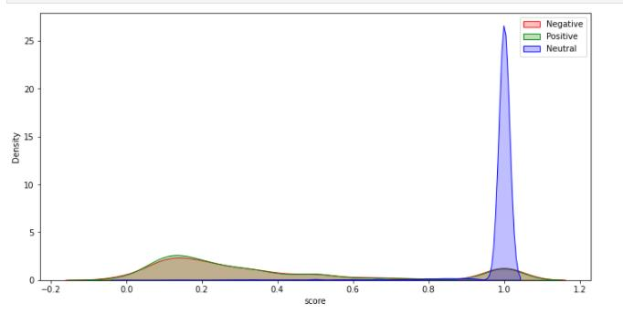

# Extracting-part-of-a-tweet-that-reflects-sentiment

## Introduction

Capturing sentiment in language is important in these times where decisions and reactions are created and updated in a matter of time. A single tweet, once it gets viral, can make an extreme impact on any company’s revenue. But if one can figure that out well ahead, a devastating loss can be prevented. But what are the words that actually lead to the sentiment description? Extraction of texts which determines the sentiment can also benefit the organization in the following ways:
- Become more competitive
- Attract new customers
- Retain present customers
- Sell more products and services
- Reduce customer servicing
- Make customers more profitable
- Improve marketing messages and campaigns

## Problem Statement

In this project, for a given tweet and its sentiment, the goal is to pick out the part of the tweet (word or phrase) that reflects the sentiment.

## Dataset

The data is acquired from the following source:
1. This dataset is taken from the twitter sentiment extraction competition on Kaggle. https://www.kaggle.com/c/tweet-sentiment-extraction/data

This dataset is available in the .csv format and it consists of the following columns:
1. textID - a unique ID for each piece of text
2. text - the text of the tweet
3. sentiment - the general sentiment of the tweet (positive, negative, neutral)
4. selected text - [train only] the text that supports the tweet's sentiment.

Each row contains the text of a tweet and a sentiment label. In the dataset, we are provided with a word or phrase drawn from the tweet (selected text) that encapsulates the provided sentiment.

In this dataset, there are 27481 unique tweets which are classified into three classes as:
1. 11118 tweets have a negative sentiment.
2. 8582 tweets have a positive sentiment.
3. 7781 tweets have a neutral sentiment.

## Pre-processing
To perform EDA, the following text pre-processing will be used:
1. To clean the tweets, stop words, symbols, extra spaces, URLs, etc. will be removed. Also, all words will be converted into lowercase.
2. Corpus will be created and based on this vocab the words in every sentence will be tokenized.
3. These sequences of text will be converted to word embeddings.

Our dataset consists of tweets in the English language which can be easily understood by humans, but we need to convert these tweets (text) into some suitable form that can be understood by the machines. There are different methods/techniques available to perform this task such as the bag of words, tf-idf, word embeddings, etc. For this project, we will be using the word embeddings (described below) instead of the bag of words and tf-idf, and the reason for this selection is that in the case of the bag of words and tf-idf techniques the contextual meaning of the sentence gets lost.

### Word Embeddings
It is a class of techniques where individual words are represented by the low-dimensional dense vectors, and for the words that have a similar meaning, they should have a similar representation. One of the benefits of using low-dimensional dense vectors is the computation.
For example:

As we know that we have to predict the specific part of the given tweet based on its sentiment, we will try to solve this as a sequence-to-sequence problem i.e., we assume our input(text) as a sequence of words and the output as 0 or 1 for the corresponding input word at each time steps (1 if the input word is responsible for sentiment, otherwise 0).
For example:

Note: The text pre-processing techniques, such as removing stop words, symbols, extra spaces, URLs, etc., will only be used for the exploratory data analysis. As the prediction can have these words in it so we will not use text pre-processing for the input of the model.

## Data Insights

### Target Distribution

Observations:
1. Out of 27481 instances, there are 7781 negative, 11118 neutral, and 8582 positive tweets.

## Data Pre-processing
### Null/Missing Values

Observations:
1. There are 27481 total instances
2. There is an instance, where the text and textID features are null.

### Feature Engineering
New features such as number of words in the given text, number of words in the selected text, difference between them and Jaccard similarity score are added

## Statistical Analysis
### Count v Number of Words in Given text

Observations:
1. This plot shows that the distribution of 'num_words_text' is approx. normal. 2. Distribution is right skewed.
2. It has only one mode.
3. Most of the tweets (mean) have 10 words only. 5. Median is greater than mode.

### Boxplot for Number of Words in Given text

Boxplot defines the exact value for the statistics:
1. Boxplot shows 75% of the tweets have word length less than or equal to 18. 2. First quartile is much less than the fourth quartile

For number of words in a tweet > 5, It is very interesting to note that the tweets have 0.82 as average Jaccard similarity score, which means that the tweet and selected text are very similar.

## Count v Number of Words in Selected text

Observations:
1. This plot shows that the distribution of 'num_words_sel_text' is approx. normal.
2. Distribution is highly right skewed.
3. It has only one mode.
4. Most of the selected text (mean) have around 7 words only.
5. Median is greater than mode.

### Boxplot for Number of Words in Selected text

Boxplot defines the exact value for the statistics:
1. Boxplot shows 75% of the tweets have word length less than or equal to 11. 2. First quartile is much less than the fourth quartile.
3. It shows that there are some outliers, which have word lengths even greater than 30.

For number of words in selected text > 10, It is very interesting to note that the tweets with neutral sentiments are more than 83% of the total tweets.

### Count v Difference of words between given text and selected text

Observations:
1. This plot shows that the distribution of 'diff_words' is approx. normal.
2. Distribution is right skewed.
3. It has only one mode.
4. Mostly difference between the number of words in a tweet and selected text (mean) is less than 8 words. 5. Median is greater than mode.

### Boxplot for Difference of words between given text and selected text

Boxplot defines the exact value for the statistics:
1. Boxplot shows 75% of the difference between the number of words in a tweet and selected text is less than or equal to 11.
2. First quartile is much less than the fourth quartile
3. It shows that there are some outliers, which have difference between the number of words in a tweet and selected text is even greater than 30.

### Count v Jaccard Score

#### What is Jaccard Score?

Observations:
1. It has only two modes, bimodal distribution.
2. The mean Jaccard score is around 0.5.
3. It shows that the number of tweets which have 0.1 and 1 as Jaccard score is much more than other tweets. 
4. Hence there are many tweets which has same words as selected text.

### Boxplot Jaccard Score

### Density v Number of words in given text

Observation:
1. The above plot shows that the distribution is approx. normal for all three categories
2. Mean number of words in a tweet with sentiment as neutral are less than the tweets with other sentiments

### Density v Number of words in selected text

Observation:
1. The peak at 0 for neutral sentiments shows that the number of words in a tweet is same as the number of words in the selected text.

### Density v Difference of words between given text and selected text

Observation:
1. The difference between the number of words in a selected text with sentiment as neutral is higher than other categories.

### Density v Jaccard Score

Observation:
1. The peak at 1 for neutral sentiments shows that the number of words in a tweet is same as the number of words in the selected text.

### Word cloud for negative tweets

### Word cloud for positive tweets

### Word cloud for neutral tweets

### Tokenizing and Padding

Text is tokenized and padded so that the it becomes compatible with model input requirements

## Modelling Approaches

Sequence Models like LSTM have transformed speech recognition, natural language processing, and other areas, and in this project, we are using the sequence models, such as Long-short term memory (LSTM), and bidirectional LSTM.

But our dataset consists of tweets in the English language which can be easily understood by humans, but we need to convert these tweets (text) into some suitable form that can be understood by the machines. There are different methods/techniques available to perform this task such as the bag of words, tf-idf, word embeddings, etc. For this project, we will be using the word embeddings instead of the bag of words and tf-idf, and the reason for this selection is that in the case of the bag of words and tf-idf techniques the contextual meaning of the sentence gets lost.

As we know that we have to predict the specific part of the given tweet based on its sentiment, we will try to solve this as a sequence-to-sequence problem i.e., we assume our input(text) as a sequence of words and the output as 0 or 1 for the corresponding input word at each time steps (1 if the input word is responsible for sentiment, otherwise 0).

### Building Model

<b> RNN: </b>
Recurrent neural networks, or RNNs, are a type of artificial neural network that add additional weights to the network to create cycles in the network graph to maintain an internal state.

Weakness of RNN:
1.	RNN tends to gradients vanishing, so it becomes difficult to update the parameters of RNN based on the longer dependencies. But in English sentences, we may have very long dependencies.
2.	Prediction at t only depends on the previous cells/inputs.

<b> LSTM: </b>
LSTM can solve the problem of RNN i.e shorter dependencies, by providing a memory cell to keep the context till it is required.

Weakness of LSTM:
1.	Though LSTM helped in longer dependencies, even now the prediction at t, only depends on the previous cells/inputs and not on the next inputs.

<b>Bidirectional LSTM:</b>
To overcome the weakness of LSTM, we will use bidirectional LSTM, in which the cell state can be used at any block.

## Sequential Model with Multiple Layers:
Three different sequnetial models are trained, one for each setiment class.

Loss Function:
In the backward propagation, the learning/optimization algorithm tries to update the parameters/weights by those values which can reduce the loss function. Hence, it becomes a crucial task to choose a correct loss function. We will try to implement two loss functions, which are binary cross-entropy loss, and Jaccard similarity.

### Model performance for negative sentiment

### Model performance for positive sentiment

### Model performance for neutral sentiment

Observations:

1. The upper graphs show that there is a difference between training and validation metric which is a sign of overfitting.
2. Validation loss increased while the validation accurace is approx. same, it shows that model is not confident with its prediction.

## Predictions

